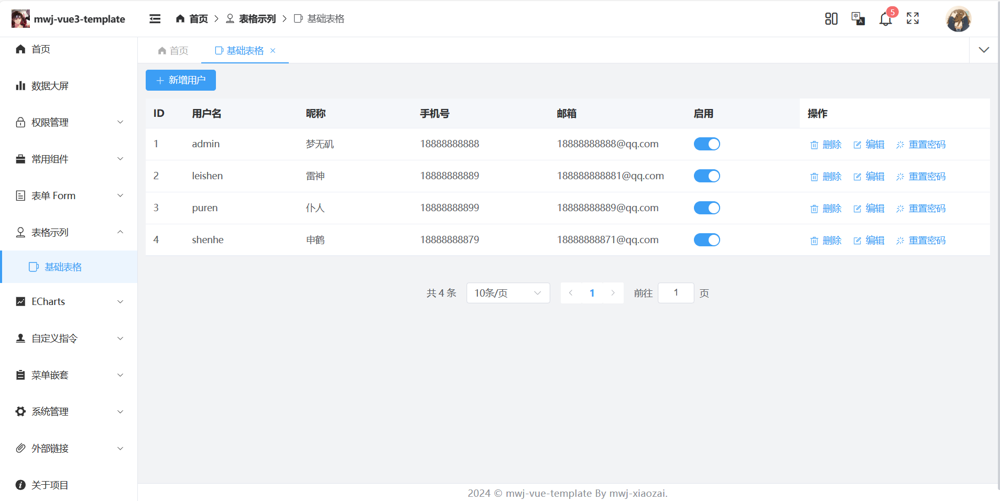
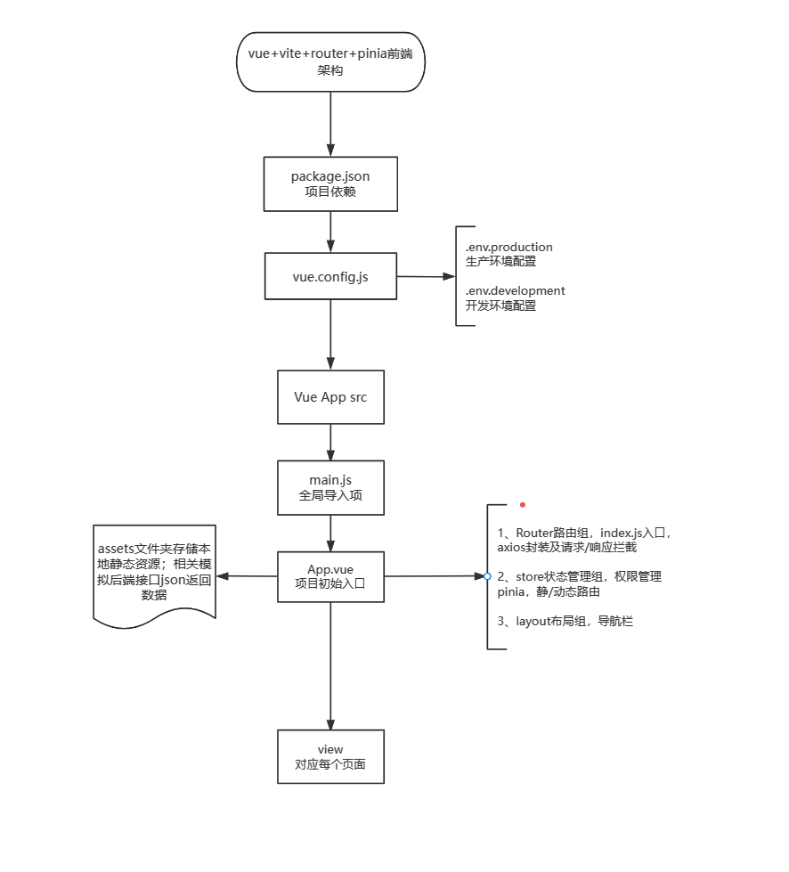

# mwj-vue3-template

基于Vue3 + TypeScript/JaveScript + Vite + Pinia + Vue-Router + Element-Plus构建的一款不依赖后端的前端模版

# 部分展示



# 项目基础架构图如下



# 本地部署

**项目下载**

```shell
git clone https://github.com/Lvan826199/mwj-vue3-template.git
```

## 依赖下载

文档待完善...

## 启动项目

文档待完善...

# docker部署

文档待完善...


# 在线体验

云服务到期时间为2024年11月,之后将无法访问

线上demo: http://localhost:8778/home/index

账号：admin

密码：123456